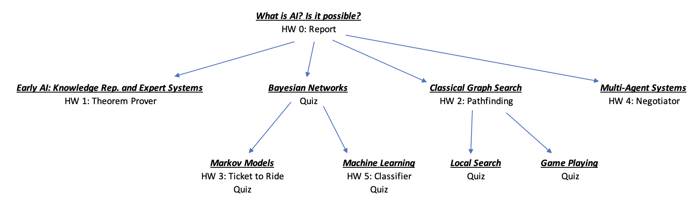

CS4710 - Artificial Intelligence Course Logistics
===============================

[Back to main page](../readme.html)

[Lectures](#lectures) | [Modules](#modules) |  [Homeworks, Quizzes and Grading Policy](#homeworks) | [Final Exam](#final) | [Final Letter Grades](#lettergrades) | 

Lectures
------------------------------------------

Lectures are held on Tuesday and Thursday from 11am - 12:15pm. Lectures will be held on [Zoom](https://zoom.us) and will be live, synchronous, and in-person. Some lectures will be used to host corporate guest-speakers who will discuss Artificial Intelligence applications in their workplace.

Modules
------------------------------------------

The course is divided into **9 overarching modules**. The modules and their structure within the course are shown in the image below. 

Each module has at least one **assessment**, whether it be a homework assignment or quiz. Most modules have one (either a homework or quiz) but two modules have both (Markov Models and Machine Learning). Your grade will be determined by how many modules you master. More detail on grading can be found below. *NOTE: You must work on pre-requisite modules BEFORE credit will be awarded for future modules. Keep this in mind.*

Homeworks, Quizzes, and Grading Policy
----------------------------------------------------------

For any **homework** or **quiz** in this course, a grade can be assigned one of three grade levels:

- **Incomplete**: The submission is not yet up to standard. This means programming assignments have major flaws or quizzes do not show competency in the course material. A grader will point out at least specific major flaw in the assignment.
- **Satisfactory**: The assignment has been given clear effort, and is close to solving the problem(s) at hand. The assignment has clear, noticeable issues still but significant progress has been made.
- **Mastered**: The assignment is perfect or near-perfect. The homework can have minor flaws and still be considered "mastered".

Every course **module** can also be in one of three states, which correspond to the ones above. At any time during the semester a module can be:

- **Incomplete**: At least one assignment or quiz in that module is incomplete.
- **Competency**: ALL assignments and quizzes for this module have reached Satisfactory level or higher.
- **Mastered**: ALL assignments and quizzes for this module have reached Mastery level.

Your final grade is determined by how many **modules** have been mastered, see below.

**Homeworks** in this course are typically programming assignments that are accompanied by a written report. Some assignments have strict input/output standards while others are more ill-defined (e.g., make a program that plays this board game really well). In each case, a report is submitted that summarizes the students approach and analyzes the problem in some depth.

**Quizzes** are given periodically to test the basic competency in modules (not all modules have a quiz). The schedule page summarizes when quiz attempts will be given.

Final Exam
----------------------------------------------------------

There is no proper final exam in this course. The final exam time will be used to allow students to have a **final attempt on any quiz that is not yet passed**. Details on this will be announced as the final exam time comes nearer.

Final Letter Grades
----------------------------------------------------------

Once the semester has ended. Each student will have a set of 9 modules, each at one of the three grading levels (incomplete, competency, or mastery). To calculate final grades, simply count how many modules are at competency level and how many modules are at mastery level. Look up the **highest row in the table below for which you reach or exceed the requirements** and that is your final course letter grade.

| Letter Grade | Modules Mastered | Modules Competent | 
|:--------------:|:---:|:---:|
| F | 0 | 0 |
| D- | 4 | 0 |
| D | 4 | 1 |
| D+ | 4 | 2 |
| C- | 5 | 1 |
| C | 5 | 2 |
| C+ | 5 | 3 |
| B- | 5 | 4 |
| B | 6 | 3 |
| B+ | 7 | 2 |
| A- | 8 | 1 |
| A | 9 | 0 |

**NOTE:** *The number of competent modules is IN ADDITION to the number of mastered modules. A Mastered module does not count towards both.*

