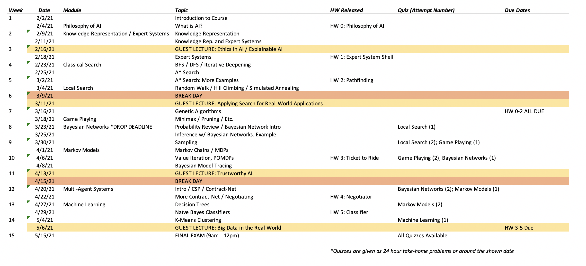

CS4710 - Artificial Intelligence
===============================

[Back to Main Page](../readme.html)

Course Schedule
---------------------------------------

The following table shows the current plan for our semester schedule. This schedule is subject to change as the semester unfolds.

Slides
---------------------------------------

| Topic | Link | Description | Reading (if applicable) |
| ------------ | :-------: | ---------------------------------------| --------------|
| 01 - Course Introduction | [Slides](01-CourseIntroduction.pptx) | Introduction to Course, Syllabus information, etc. | |
| 02 - Intro to AI | [Slides](02-IntroToAI.pptx) ([pdf](./pdf/02-IntroToAI.pdf)) | What is AI? What are the sub-fields of AI? Is AI possible? | |
| 03 - Knowledge Representation | [Slides](03-KnowledgeRepresentation.pptx) ([pdf](./pdf/03-KnowledgeRepresentation.pdf)) | Classic AI using construction of knowledge within some data structure. | [Newell and Simon](../readings/newellSimon.pdf) |
| 04 - Expert Systems | [Slides](04-ExpertSystems.pptx) ([pdf](./pdf/04-ExpertSystems.pdf)) | Early expert systems and some simple algorithms. | |
| 05 - Classic Search | [Slides](05-Search-ClassicalSearch.pptx) ([pdf](./pdf/05-Search-ClassicalSearch.pdf)) | Graphs, BFS, DFS, and searching on large graphs. | |
| 06 - Local Search | [Slides](06-Search-LocalSearch.pptx) ([pdf](./pdf/06-Search-LocalSearch.pdf)) | Simulated Annealing and Genetic Algorithms. | |
| 07 - Game Playing | [Slides](07-Search-GamePlaying.pptx) ([pdf](./pdf/07-Search-GamePlaying.pdf)) | Using search algorithms to play games for you. | |
| 08 - Bayesian Networks | [Slides](08-Uncertainty-BayesNets.pptx) ([pdf](./pdf/08-Uncertainty-BayesNets.pdf)) | Making predictions using bayesian networks. | |
| 09 - Markov Models | [Slides](09-Uncertainty-MarkovModels.pptx) ([pdf](./pdf/09-Uncertainty-MarkovModels.pdf)) | Using markov models to model action-reward structures. | |
| 10 - Bayesian Model Tracing | [Slides](10-BayesianModelTracing.pptx) ([pdf](./pdf/10-BayesianModelTracing.pdf)) | An example application of a HMM to a real problem in education. ||
| 11 - Mult-Agent Systems | [Slides](11-MultiAgentSystems.pptx) ([pdf](./pdf/11-MultiAgentSystems.pdf)) | Some basic issues involved in multipel AIs working together (or against each other) | |
| 12 - ML: Version Spaces | [Slides](12-ML-IntroVersionSpace.pptx) ([pdf](./pdf/12-ML-IntroVersionSpace.pdf)) | Version Space Learning. The Basics of ML | |
| 13 - ML: Decision Trees | [Slides](13-ML-DecisionTrees.pptx) ([pdf](./pdf/13-ML-DecisionTrees.pdf)) | ID3 and simple decision tree learning | |
| 14 - ML: Regressions | [Slides](14-ML-Regressions.pptx) ([pdf](./pdf/14-ML-Regressions.pdf)) | Basic ML regressions. | |
| 15 - ML: Naive Bayes | [Slides](15-MachineLearning-NaiveBayes.pptx) ([pdf](./pdf/15-MachineLearning-NaiveBayes.pdf)) | Naive Bayes classifiers and associated algorithms. | |
| 16 - ML: Neural Nets | [Slides](16-MachineLearning-NeuralNetworks.pptx) ([pdf](./pdf/16-MachineLearning-NeuralNetworks.pdf)) | Basic neural networks and backpropogation. | |
| 17 - ML: Clustering | [Slides](17-MachineLearning-Clustering.pptx) (n/a) | Simple unsupervised learning. | |
